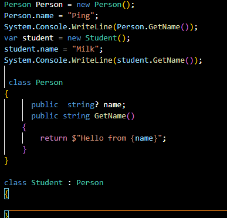
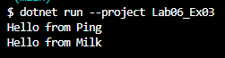

## 3
## Error เนื่องจาก เป็นinstant ควรเปลี่ยนเป็นstatic
## แก้โค้ดเป็น 

## สร้างตัวแปร person เพิ่มขึ้นมา

## 5

## การทำงานคือ สร้างตัวแปรและรับค่าชื่อ โดยใช้ Person และ Student และนำมาเข้า class person จากนั้นก็ประมวลผลการทำงานและแสดงผลออกมาทางหน้าจอ