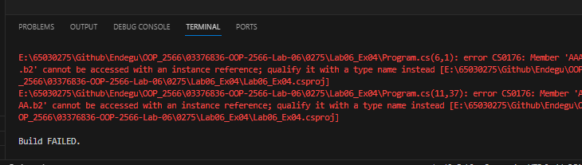
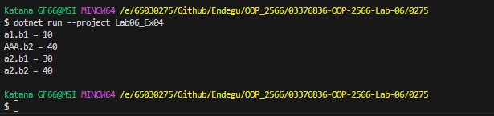

var a1 = new AAA();
var a2 = new AAA();
a1.b1 = 10;
AAA.b2 = 20;
a2.b1 = 30;
AAA.b2 = 40;

System.Console.WriteLine($"a1.b1 = {a1.b1}");
System.Console.WriteLine($"AAA.b2 = {AAA.b2}");
System.Console.WriteLine($"a2.b1 = {a2.b1}");
System.Console.WriteLine($"a2.b2 = {AAA.b2}");

class AAA 
{
    public int b1;
    public static int b2;

}

โค้ดแก้

a1.b1 = 10; กำหนดค่าให้กับฟิลด์ b1 ของ a1 ให้มีค่าเป็น 10
AAA.b2 = 20; กำหนดค่าให้กับฟิลด์ b2 ของคลาส AAA ให้มีค่าเป็น 20 (เป็นฟิลด์ static จึงใช้ได้โดยตรงผ่านชื่อของคลาส)