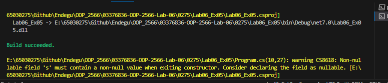
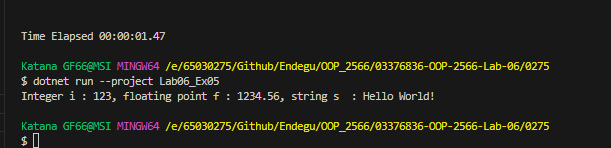

บรรทัดแรกกำหนดค่าให้กับตัวแปร static i ในคลาส StaticDemo ให้มีค่าเป็น 123
บรรทัดที่สองกำหนดค่าให้กับตัวแปร static f ในคลาส StaticDemo ให้มีค่าเป็น 1234.56
บรรทัดที่สามกำหนดค่าให้กับตัวแปร static s ในคลาส StaticDemo ให้มีค่าเป็น "Hello World!"
บรรทัดที่สี่เรียกใช้เมธอด static PrintValues() ในคลาส StaticDemo ซึ่งทำหน้าที่แสดงค่าของ i, f, และ s ที่ถูกกำหนดไว้ในคลาส