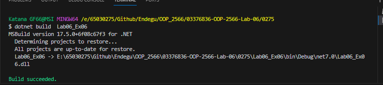
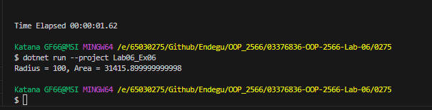

const double PI = 3.14159;: ประกาศค่าคงที่ PI ที่มีค่าเป็น 3.14159 ซึ่งใช้ในการคำนวณพื้นที่ของวงกลม

public static void PrintCircleArea(double radius): เมธอด static PrintCircleArea ที่รับพารามิเตอร์ radius และใช้สูตร PI * radius * radius เพื่อคำนวณพื้นที่ของวงกลม