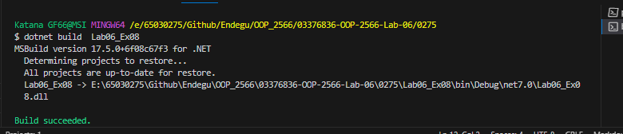

Circle.PrintCircleArea(100);
class Circle
{
    const double PI = 3.14159;
    public static void PrintCircleArea(double radius)
    {
        
        System.Console.WriteLine($"Radius = {radius}, Area = {PI * radius * radius}");
    }
}

